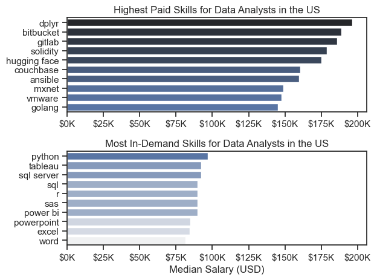

# 📊 Data Analysis & Visualization Projects

This repository contains end-to-end Data Analysis projects where I
perform **data cleaning, exploratory data analysis (EDA),
visualizations, and insights extraction** using Python.

The repo includes two major projects:

------------------------------------------------------------------------

## 📁 Project 1: Movie Analysis (Indian Movies Dataset)

### 🔍 **Objective**

Analyze Indian movies dataset to understand: - Most common genres
- Rating distribution
- Relationship between rating and year
- Patterns in movie duration
- Trends in movie releases over time
- Dataset source: Kaggle

### 🛠 **Skills Used**

-   **Pandas** (cleaning, wrangling)
-   **NumPy**
-   **Matplotlib & Seaborn** (visualization)
-   **Data preprocessing & feature extraction**

### 📌 **Key Insights**

-   Identified most popular genres
-   Analyzed trends in ratings
-   Cleaned missing values in duration, ratings
-   Visualized distribution of movies over years

### 📂 **Folder Contents**

    Movie Analysis Project/
    │-- Indian_Movies.csv
    │-- Cleaned_Indian_Movies.csv
    │-- Cleaning_Movie_Analysis.ipynb
    │-- Analysis.ipynb
    │-- images/ (visualizations)

------------------------------------------------------------------------

## 📁 Project 2: Data Jobs Analysis (US Job Market)

### 🔍 **Objective**

Analyze the US Data Analyst job market to understand: - Salary trends
- In-demand technical skills
- Highest-paying skills
- Skills required for entry-level jobs

Dataset source: HuggingFace dataset `lukebarousse/data_jobs`.

### 🛠 **Skills Used**

-   **Pandas** (merging, grouping, filtering)
-   **Seaborn & Matplotlib** (barplots, boxplots, histograms)
-   **Data visualization design**
-   **Statistical analysis**

### 📌 **Key Insights**

-   Identified top 10 highest-paid skills
-   Ranked most in-demand skills
-   Visualized salary distributions
-   Compared skill demand vs salary

### 📂 **Folder Contents**

    Data_Jobs_analysis/
    │-- data_jobs_salary_all.xlsx
    │-- EDA.ipynb
    │-- Salary_Analysis.ipynb
    │-- Skill_Demand.ipynb
    │-- images/ (plots)

------------------------------------------------------------------------

## 🧰 **Tech Stack**

-   Python
-   Pandas
-   NumPy
-   Matplotlib
-   Seaborn
-   Jupyter Notebook

------------------------------------------------------------------------

## 📸 Sample Visualizations
### 📊 Highest Paid Skills

### Job per Country

### Salary Distribution

### 🎬 Movie Rating Distribution

### Top Genre

